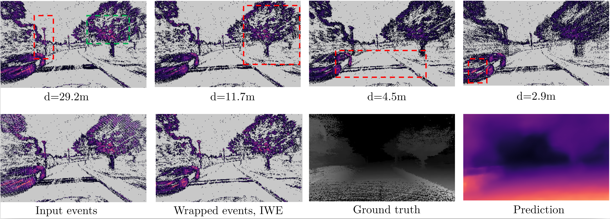

# Learning Monocular Depth from Events via Egomotion Compensation 


[]()

This is the repository for **Learning Monocular Depth from Events via Egomotion Compensation**.

For a blind review, all the code, data and links are anonymized. 

 <!-- - [Paper]() -->

## Getting Started with the code

### Dependencies:
* Pytorch  
* Python 
* CUDA
* OpenCV
* h5py
* TorchVision

### Install with Anaconda
To reproduce the results, you create a new conda environment with the following command:
```conda create -n E2DEPTH
conda activate DDE
conda install pytorch torchvision cudatoolkit=11.7 -c pytorch
conda install -c conda-forge opencv
conda install -c conda-forge matplotlib
```
You also need to install the h5py package using pip:
```pip install h5py```


### Organize the dataset
To evaluate our model, you need to download the processed [data](https://drive.google.com/file/d/1O39yz9UmkRVgtb26NilbyhpzuqEKAtFD/view?usp=sharing) and extract it. your directory tree should be as follows:

├── dataset<br>
│   ├── MVSEC<br>
│   │   ├── outdoor_day1<br>
│   │   ├── outdoor_day2<br>
│   │   └── outdoor_night1<br>
│   ├── EventCitySim <br>
│   │   ├── town1 <br>
│   │   ├── town2_night <br>
│   │   ├── town3 <br>
│   │   ├── town4 <br>
│   │   └── town5_night <br>


### Install
Build deformable convolution
```bash
cd /root/code/src/components/models/deform_conv

bash build.sh
```

### Run the code
To run the evaluation for outdoor_day1 sequence:
```
cd src

python eva.py \
--config_path ../configs/config_mvsec.yaml \
--checkpoint_path  ../checkpoint/mvsec_checkpoint.pth\
--data_root ../dataset 
--save_root ../results
```
## EventCitySim dataset

We anonymously release the dataset used in the paper, you can download it for evaluation

* [EventCitySim](https://drive.google.com/drive/folders/16ZxHx2iNAJlE9iNAJyi5RJ2GjdGdNs38?usp=sharing)

The dataset can be converted to the numpy arrays by running the following command:
``` 
python scripts/convert_to_h5.py 
```
